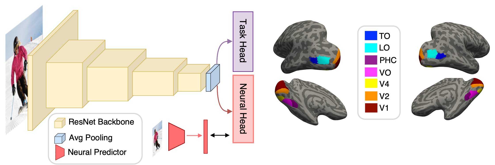

# NeuralGuidance

This is the code repo for [*Probing Human Visual Robustness with Neurally-Guided Deep Neural Networks*](https://arxiv.org/abs/2405.02564) 
by Zhenan Shao, Linjian Ma, Yiqing Zhou, Yibo Jacky Zhang, Sanmi Koyejo, Bo Li, and Diane M. Beck.

:tada: We gave an oral presentation [@*VSS2024*](https://www.visionsciences.org/talk-session/?id=164). Recordings are available [here](https://www.youtube.com/watch?v=O67BelJTyXY).

[//]: # (### figure)

[//]: # (### Abstract)

**Abstract**:

Humans effortlessly navigate the dynamic visual world, yet deep neural networks (DNNs), despite excelling at many visual tasks, are surprisingly vulnerable to minor image perturbations. Past theories suggest that human visual robustness arises from a representational space that evolves along the ventral visual stream (VVS) of the brain to increasingly tolerate object transformations. To test whether robustness is supported by such progression as opposed to being confined exclusively to specialized higher-order regions, we trained DNNs to align their representations with human neural responses from consecutive VVS regions while performing visual tasks. We demonstrate a hierarchical improvement in DNN robustness: alignment to higher-order VVS regions leads to greater improvement. To investigate the mechanism behind such robustness gains, we test a prominent hypothesis that attributes human robustness to the unique geometry of neural category manifolds in the VVS. We first reveal that more desirable manifold properties, specifically, smaller extent and better linear separability, indeed emerge across the human VVS. These properties can be inherited by neurally aligned DNNs and predict their subsequent robustness gains. Furthermore, we show that supervision from neural manifolds alone, via manifold guidance, is sufficient to qualitatively reproduce the hierarchical robustness improvements. Together, these results highlight the critical role of the evolving representational space across VVS in achieving robust visual inference, in part through the formation of more linearly separable category manifolds, which may in turn be leveraged to develop more robust AI systems.

***
### TODO:

- [ ] **Manifold analysis and Manifold Guidance code to be uploaded**
    
***
### Data:
- Original human neural data are retrieved from the Natural Scene Dataset (NSD) (Allen et al., 2022) publically available on [here](https://naturalscenesdataset.org/).

- Further processing of neural data for neural predictor training uses scripts in [neural_data_proc/](./neural_data_proc)

- Images used to train neural predictors are a selection from MSCOCO used in NSD for participants to view. Images used in neural-guidance training were obtained from [ImageNet](https://www.image-net.org/download.php) and [CIFAR-100](https://www.cs.toronto.edu/~kriz/cifar.html). Details on these image sets are in the Methods section of our manuscript.

[//]: # (- Fully trained weights of neural predictors used in our experiment have also been made available [here]&#40;https://osf.io&#41;. )

***
### Folder walkthrough

**neural_data_proc/**: 
All processing scripts needed to further clean and extract neural data from the NSD dataset.
Note: need [**AFNI**](https://afni.nimh.nih.gov/pub/dist/doc/htmldoc/background_install/main_toc.html) (Version AFNI_20.0.4) to run the scripts.

**neural_predictor_training/**: 
Scripts used to train neural predictors. Need to have the fully processed neural data and images ready. 
Neural predictors used for ImageNet images and CIFAR-100 images have different structures to accomodate image difference. 
main_regular.py is for the regular neural predictor, and main_cifar.py is to run the version designed for CIFAR-100.

**neural_guidance_training/**:
Scripts used to train the double-headed Resnet-18-based DNN to perform both classification and neural representation learning. 
Need to have fully trained neural predictors ready. Again, we have two versions to deal with imageNet and CIFAR-100. 
We included 7 neurally-guided models, 4 baseline models, and additional 5 WD-models (with different levels of weight decay
values that creates models with comparable level of output surface smoothness).

**captioning/**:
This is to adapt the neurally-guided DNNs to serve as the encoder for an image captioning task. 
The encoder-decoder structure and the pretrained-weights of decoders were obtained from [Show-Attend-Tell](https://arxiv.org/abs/1502.03044).

**analysis/**:  
- attacks.py: this file contains scripts to run all adversarial attacks we investigated.
- texture_shape_prep.py: this file contains how we generated the texture-shape blended imageset for texture-shape bias evaluation.
- texture_shape_test.py: evaluation of model's texture versus shape bias. 
- smoothness.py: this file contains both the smoothness quantification and loss landscape (w.r.t input images) surface visualization. 
- RSA.py: this folder contains how the representation space similarity matrix was generated across all models used, along with the MDS visualization.
- noise_ceiling.py: this shows how to estimate the noise ceiling of neural data from each ROI using methods presented in the NSD.

