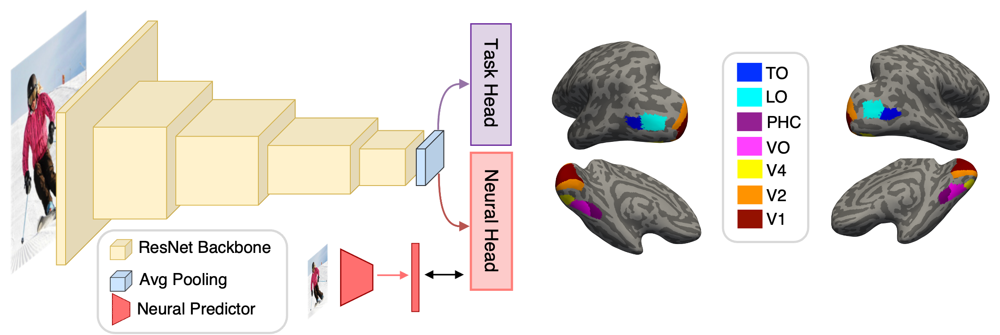

# NeuralGuidance

This is the code repo for [*Probing Human Visual Robustness with Neurally-Guided Deep Neural Networks*](https://arxiv.org/abs/2405.02564) 
by Zhenan Shao, Linjian Ma, Yiqing Zhou, Yibo Jacky Zhang, Sanmi Koyejo, Bo Li, and Diane M. Beck. (2024)

[//]: # (### figure)


[//]: # (### Abstract)

**Abstract**:

Humans effortlessly navigate the visual world, yet deep neural networks (DNNs), despite excelling at many visual tasks, are surprisingly vulnerable to minor image perturbations. Past theories suggest human visual robustness arises from a representational space that evolves along the ventral visual stream (VVS) of the brain to increasingly tolerate object transformations. To test whether robustness is supported by such progression as opposed to being confined to specialized higher-order regions, we trained DNNs to align their representations with human neural responses from consecutive VVS regions during visual tasks. We demonstrate a hierarchical improvement in DNN robustness: alignment to higher-order VVS regions yields greater gains. To investigate the mechanism behind this improvement, we test a prominent hypothesis that attributes human visual robustness to the unique geometry of neural category manifolds in the VVS. We show that desirable manifold properties, specifically, smaller extent and better linear separability, emerge across the human VVS. These properties are inherited by DNNs via neural guidance and can predict their subsequent robustness gains. Further, we show that supervision from neural manifolds alone, via manifold guidance, suffices to qualitatively reproduce the hierarchical robustness improvements. Together, our results highlight the evolving VVS representational space as critical for robust visual inference, with the more linearly separable category manifolds as one potential mechanism, offering insights for building more resilient AI systems. 

***
### TODO:

- [ ] **Manifold analysis and Manifold Guidance code to be uploaded**


***
### Requirements

The usual ML, pytorch, python suites are required. We tested in an environment with python == 3.9.18, torch == 2.0.1+cu117, and we used 4 * A40 GPUs to train the Neurally guided models. We provide a [requirements.txt](./requirements.txt) here for your reference. 

---
### Data

- Original human neural data are retrieved from the Natural Scene Dataset (NSD) (Allen et al., 2022) publically available on [here](https://naturalscenesdataset.org/).

- Further processing of neural data for neural predictor training uses scripts in [neural_data_proc/](./neural_data_proc). See below for usage.

- The MSCOCO images used in NSD can also be obtained from NSD official source.

- Images used to train neural predictors are a selection from MSCOCO used in NSD for participants to view. Images used in neural-guidance training were obtained from [ImageNet](https://www.image-net.org/download.php) and [CIFAR-100](https://www.cs.toronto.edu/~kriz/cifar.html). Details on these image sets are in the Methods section of our manuscript.

[//]: # (- Fully trained weights of neural predictors used in our experiment have also been made available [here]&#40;https://osf.io&#41;. )

***
### Usage

#### Neural representation extraction [optional]
All processing scripts needed to further clean and extract neural data from the NSD dataset are stored in [neural_data_proc/](./neural_data_proc/). Below we provide how to process the data and extract the neural representations needed using Subject 1 as an example.
:exclamation:**Note**: need [**AFNI**](https://afni.nimh.nih.gov/pub/dist/doc/htmldoc/background_install/main_toc.html) (Version AFNI_20.0.4) to run the scripts.

1. Download data files: [Kastner2015](https://napl.scholar.princeton.edu/resources) ROI masks, nsdgeneral mask, and the anatomical volume from NSD: 
   We provide the get_data_roi.sh to do this with command:
   ```bash
   bash ./neural_data_proc/get_data_roi.sh subj01 sub1
   ```
   :exclamation:**Note1**: The second argument is optional, but will change under what ID the subject's data is used in local directory. This will create a "sub1_nsd" folder.
   :exclamation:**Note2**: The experiment design file: nsd_expdesign.mat is also dowloaded. This is the same for all subjects.

2. We also provide the scripts to extract ROI needed:
   Using V1 as an example:
   ```bash
   bash ./neural_data_proc/extract_roi.sh sub1 V1
   ```
   :exclamation:**Note1**: Choices of ROIs: V1, V2, V4, VO, PHC, LO, TO.
   :exclamation:**Note2**: You should see the ROI mask files such as "sub1_V1.nii" in the sub1_nsd/ folder. Once repeating this procedure for all desirable ROIs, remember to visually check that your ROIs are in the right places using AFNI!

   :exclamation:**Note3**: Most of the ROIs may have two sub-divisions. For example, there are V1v and V1d stored in the original Kastner atlas, corresponding to both the ventral division and dorsal division of V1. One reason is that these halves, especially for earlier retinotopic regions, each responsible for half of the visual field (e.g. upper and lower halves.). Therefore, we combine them to obtain the full ROI. This division of responsibility is more nuanced when we move up the hierarchy, reaching places like LO with two sub-divisions: LO1 and LO2.

3. Then turn NIFTI formatted ROIs masks into numpy arrays for more convenient processing in the next sep. 
   Usage:
   ```bash
   python ./neural_data_proc/prep_roi.py --sub sub1 --roi V1
   ```
   :exclamation:**Note1**: Should see "sub1_V1.pkl" in sub1_nsd/ folder.

4. The beta estimates files need to be obtained from NSD first using: 
   ```bash
   python ./neural_data_proc/get_data_beta.py --sub-onl subj01 --sub-loc sub1 --num-ses 40
   ```
   :exclamation:**Note1**: Even data for one subject is huge!! 
   :exclamation:**Note2**: You may see an error message showing that only 38 session are downloaded. This is because two sessions of the NSD data have been withheld for the [Algonauts](https://algonautsproject.com/2023/index.html) challenge, although they should be released soon. 

5. Next we generate the test and val split of NSD data for a given ROI, e.g., V1. Neural responses have also been further PCA'ed for further cleaning. 
   Run prep_beta.py as follows: 
   ```bash
   python ./neural_data_proc/prep_beta.py --sub sub1 --roi V1
   ```
   :exclamation:**Note1**: The train/test split "sub1_V1_data.pkl" can be found in the newly created folder: sub1_data/


#### Neural predictors
Scripts used to train neural predictors are stored in [neural_predictor_training/](./neural_predictor_training/). Neural predictors used for ImageNet images and CIFAR-100 images have different structures to accomodate image resolution difference. Therefore, we have `main_regular.py` for the regular neural predictor, and `main_cifar.py` for running the version designed for CIFAR-100. Below we provide an example with Subject-1 and V1 ROI.
:exclamation:**Note**: Need to have the fully processed neural data and images ready. 

1. Before training, we will need the MSCOCO image stimuli used in NSD. The stimuli is available for downloading from NSD website. We provide a script to download and then split it for the 8 subjects in the dataset for convenience.
   ```bash
   python ./neural_predictor_training/NSD-MSCOCO_stim_processor.py
   ```
   :exclamation:**Note**: This will put all 8 subjects' stimuli data into a new folder: ./nsd_coco_stimuli/

2. :star2:**training**: Use the following to train neural predictor on one subject:
    ```bash
    python ./neural_predictor_training/train.py --sub sub1 \
                    --roi V1 \
                    --roi-data-dir ./sub1_data \
                    --stim-data-dir ./nsd_coco_stimuli \
                    --save-dir ./sub1_NPs \
                    --lr 0.001 \
                    --batch_size_train 256 \
                    --batch_size_val 100 \
                    --epk 40 \
                    --save-interval 5
    ```
    :exclamation:**Note**: There is an additional optional `--shuffle` flag. If this is enabled, the correspondence between images and corresponding neural data will be shuffled, serving as control condition to examine whether the neural predictors are effective (Appendix B. figure 6 in our manuscript).


#### Neural guidance
Scripts used to train the double-headed Resnet-18-based DNN to perform both classification and neural representation learning are provided in [neural_guidance_training/](./neural_guidance_training/). Again, we have two versions to deal with imageNet and CIFAR-100. We included 7 neurally-guided models, 4 baseline models, and additional 5 WD-models (with different levels of weight decay values that creates models with comparable level of output surface smoothness).

:exclamation:**Note**: Need to have fully trained neural predictors ready, and the imageNet image sets. We use a subset of categories.

1. :star2:**training**: Using Subject 1, ROI V1 as an example, run the following to train the model. 
    ```bash
    SUB_ID="sub1"
    ROI=V1
    save_dir="./sub1_NG_models"
    imagenetDir="YOUR_IMAGENET_DIR"
    subset_categories_txt="./neural_guidance_training/coco50.txt"
    neural_predictor_pth="./sub1_NPs/YOUR_NP_PATH.pth"

    python ./neural_guidance_training/cotrain.py ${imagenetDir} \
            --img_folder_txt ${subset_categories_txt} \
            --save_dir ${save_dir} \
            --neural_predictor_pth ${neural_predictor_pth} \
            --train_id coco50 \
            --roi ${ROI} \
            --arch resnet18 \
            --neural-arch resnet18 \
            --pretrained \
            --batch-size 1024 \
            --lr 0.015 \
            --alpha 0.9  \
            --save-interval 2 \
            --rank 0 \
            --dist-url 'tcp://127.0.0.1:2000' \
            --dist-backend 'nccl' \
            --multiprocessing-distributed \
            --world-size 1
    ```
    :exclamation:**Note1**: There are again `--shuffle` flag to shuffle the correspence between images and neural representations (see our manuscript for details).


#### Manifold guidance
Scripts used to extract category manifold stats and perform manifold guidance are provided in [manifold_guidance/](./manifold_guidance/).

1. Extract the radius, center and basis for each category manifold using the following: 
    ```bash
    SUB_ID="sub1"
    ROI=V1
    imagenetDir="YOUR_IMAGENET_DIR"
    subset_categories_txt="./neural_guidance_training/coco50.txt"
    NP_feats_pth="YOUR_PATH_TO_NP_FEATURES"

    python ./manifold_guidance/extract_manifold_stats.py ${imagenetDir}
        --sub ${SUB_ID} \
        --roi ${ROI} \
        --img_folder_txt ${subset_categories_txt} \
        --seed 42 \
        --batch-size 1024 \
        --orig-np-feats ${NP_feats_pth} \
        --data_workers 4
    ```
    :exclamation:**Note1**: need to have the neural representations for the imagenet images ready at `NP_feats_pth`. Will then output the extracted stats with paths like "./sub1_manifold/V1_manifold_stats_var0.95.pkl"

2. :star2:**training**: Use the following command for training with manifold guidance:

    ```bash
    SUB_ID="sub1"
    ROI=V1
    imagenetDir="YOUR_IMAGENET_DIR"
    subset_categories_txt="./neural_guidance_training/coco50.txt"
    manStats="./sub1_manifold/V1_manifold_stats_var0.95.pkl"
    
    python ./manifold_guidance/cotrain_man.py ${imagenetDir} \
        --sub ${SUB_ID} \
        --roi ${ROI} \
        --img_folder_txt ${subset_categories_txt} \
	    --save-dir ./${SUB_ID}_manifold \
        --precomputed-man-stats $manStats \
        --arch "resnet18" \
        --seed 42 \
        --pretrained \
        --batch-size 4096 \
        --lr 0.1 \
        --weight-decay 0.0001 \
        --epochs 46 \
        --save-interval 4 \
        --print-freq 1 \
        --alphas 0.08 0.3 0.62 \
        --multiprocessing-distributed \
        --dist-url 'tcp://127.0.0.1:2000' \
        --dist-backend 'nccl' \
        --world-size 1 \
        --rank 0
    ```
    :exclamation:**Note1**: `alphas` are the weighting for the classification, dimension and radius loss, respectively. These alphas are tuned for different areas based on whether the clean accuracy is comparable with the baseline model for a fair game at subsequent robustness evaluations. Manifold guidance training is much harder to converge than neural guidance. 


#### Analysis
All scripts to perform various analyses and recreate the results and figures are in [analysis/](./analysis/).
1. **Robustness Evaluation**: `attack.py` allows performing various attacks leveraging the foolbox package. `autoattack.py` allows performing the strong autoattack on models. `transfer_attack.py` performs transfer attack as described in the paper.
2. **smoothness**: `smoothness.py` contains both the smoothness quantification and loss landscape (w.r.t input images) surface visualization.
3. **RSA**: `RSA.py` contains how the representation space similarity matrix was generated across all models used, along with the MDS visualization (fig 2C in our manuscript).
4. **noice_ceiling**: this shows how to estimate the noise ceiling of neural data from each ROI using methods presented in the NSD. We used the same method from the NSD paper. This will generate a pickle file including the NC estimates for each voxel in V1, named "sub1_V1_NC.pkl" in the current directory
This pickle file can be used to generate NC box plot using [plot_noise_ceiling.ipynb](../plots/plot_noise_ceiling.ipynb)


### Citation

If you find this work useful, please consider citing our preprint:

```bibtex
@article{shao2024probing,
  title={Probing Human Visual Robustness with Neurally-Guided Deep Neural Networks},
  author={Shao, Zhenan and Ma, Linjian and Zhou, Yiqing and Zhang, Yibo Jacky and Koyejo, Sanmi and Li, Bo and Beck, Diane M},
  journal={arXiv preprint arXiv:2405.02564},
  year={2024}
}
```

### Contact
Feel free to email me @zhenans2@illinois.edu
